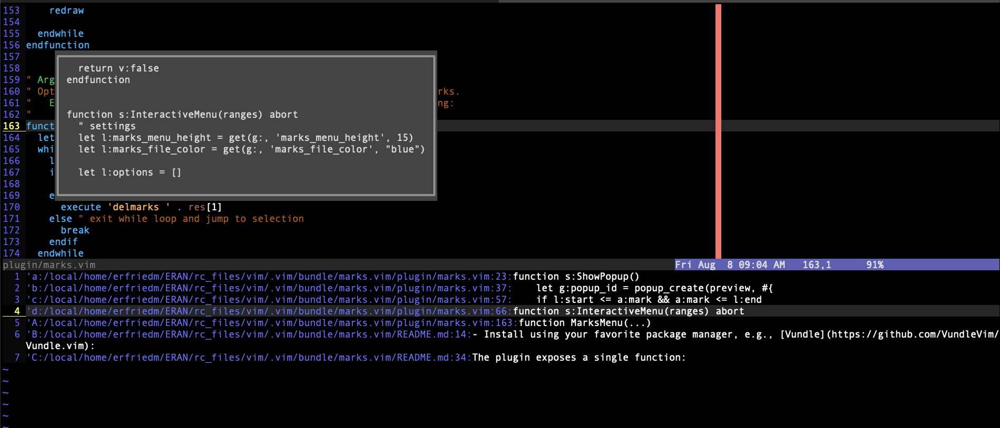

# marks.vim

A handy Vim plugin to manage and interact with `marks`.

Using this plugin, you can:
- Displays all the marks (including local, global and special marks).
- Iterate the marks with a preview popup.
- Jump to a mark.
- Delete a mark.




## Installation

- Install using your favorite package manager, e.g., [Vundle](https://github.com/VundleVim/Vundle.vim):

    1. Add the following to your .vimrc: `Plugin 'eranfrie/marks.vim'`.
    2. Reload .vimrc.
    3. Run: `:PluginInstall`.

- Manual installation: copy `marks.vim` to your plugin directory
    (e.g., `~/.vim/plugin/` in Unix / Mac OS X).


## Selection Menu:

- `Down` / `Up` / `PageDown` / `PageUp` to navigate the menu.
- `Enter` to jump to a mark.
- `Esc` / `Ctrl-C` to close the selection manu.
- `Backspace` / `Delete` to delete a mark.


## Functions:

The plugin exposes a single function:
`MarksMenu(...)`.

The function accepts an optional argument, list of pairs, to filter the marks.
E.g., to display only the user-defined imarks (local and global), call
`MarksMenu([["a","z"], ["A", "Z"]])`.


## Customizations:

- Set the height (number of lines) of the selection menu
```
let g:marks_menu_height = 15
```
- Set the color of the file path
```
let g:marks_file_color = "blue"
```
- Disable loading the plugin
```
let g:loaded_marks = 1
```


## Mappings:

Keys are not mapped automatically. You can choose your own mapping,
For example:
```
nnoremap <leader>m :call MarksMenu()
```
